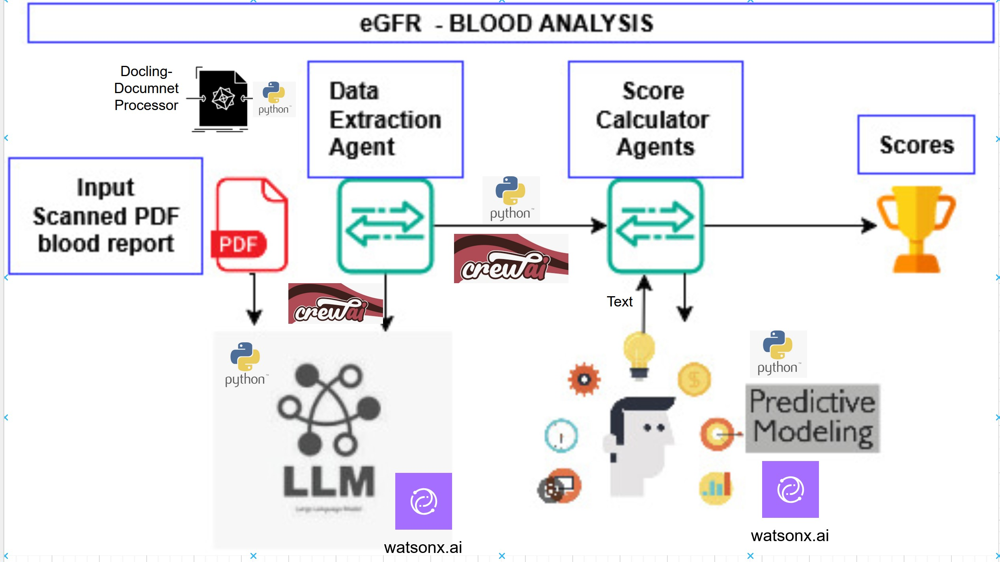

# HealthCare Use Case - Agentic Workflow

This is the source code of the IBM Developer article published [here](https://github.com/IBM/i-oic-better-together-data-ai-healthcare).

Note that this is PoC quality code not meant to be deployed as-is in a production environment. The source code has not been containerized. The code has been tested in a Windows11 but it could be adapted to other platforms.

## Getting Started
1.Clone the respository
```bash
    git clone https://github.com/IBM/i-oic-better-together-data-ai-healthcare
```

2.In the **tools/ckd_v3** folder, find the custom tool configuration, including the Docling intergration for PDF parsing.

3.The **yaml** folder contains YAML files for defining agents and task configurations.

4.From the local folder, run **main.py** to execute the workflow locally. Change the input data as needed.

## Predictive Model
The provided document describes how we trained a CKD prediction model using a Kaggle dataset and hosted it on watsonx.ai.



