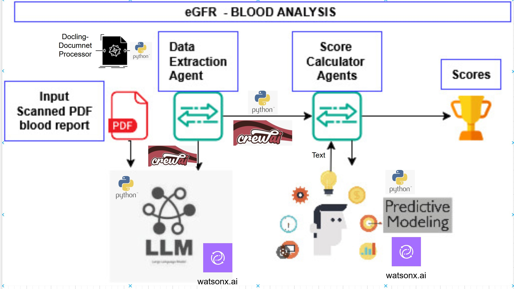

# HealthCare Use Case - Agentic Workflow

This is the source code of the IBM Developer article published [here](https://github.com/IBM/i-oic-better-together-data-ai-healthcare).

Note that this is PoC quality code not meant to be deployed as-is in a production environment. The source code has not been containerized. The code has been tested in a Windows11 Thinkpad laptop with LENOVO 21FWS1J30B but it could be adapted to other platforms.

There is a ckd_v3 folder consists custom tool configuration has python module for docling configuration to run crewai agents.

## Getting Started
1.Clone the respository
```bash
    git clone https://github.com/IBM/i-oic-better-together-data-ai-healthcare
```

2.**custom_tool.py** has a module to read scanned pdf using docling has text nodes.

3.**crew_config** folder has the yaml name,role, decription for agent and tasks.

4.**main.py** This is intended to run your crew locally, Replace with inputs you want to test with.

## Predictive Model
The Predictive model document provided has Watsonx machine learning model was used with kaggle dataset for classifying CKD or Non CKD.



